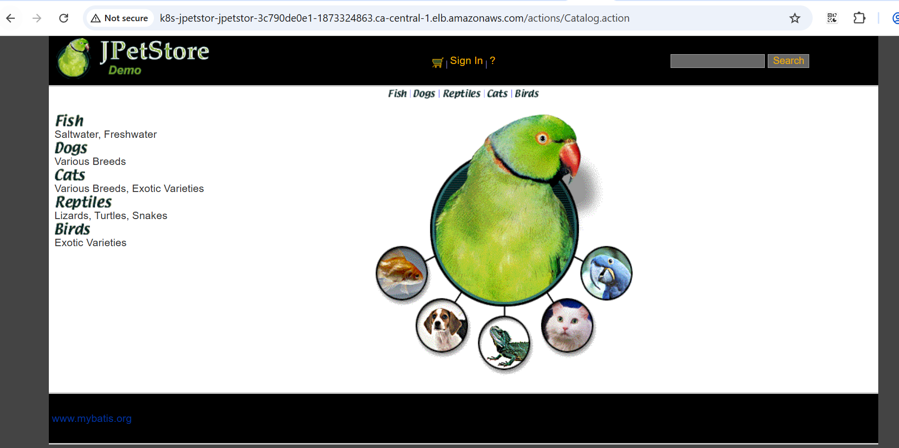
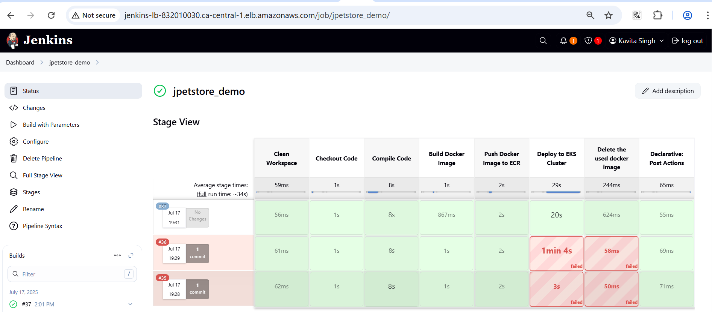

# Cisco Demo Project Documentation for WAR Deployment to EKS Clusters

---

## 🛠️ Prerequisites and Configuration

### Install Required Packages on Jenkins Server

#### ✅ Java Installation
```bash
sudo dnf install java-17-amazon-corretto -y
```

#### ✅ Jenkins Installation
```bash
sudo wget -O /etc/yum.repos.d/jenkins.repo https://pkg.jenkins.io/redhat-stable/jenkins.repo
sudo rpm --import https://pkg.jenkins.io/redhat-stable/jenkins.io.key
sudo yum install jenkins -y
sudo systemctl start jenkins
sudo systemctl enable jenkins
```
#### ✅ Docker Installation
```bash
sudo yum install docker
```

#### ✅ kubectl CLI Installation Installation
```bash
 curl -O https://s3.us-west-2.amazonaws.com/amazon-eks/1.33.0/2025-05-01/bin/linux/amd64/kubectl
 curl -O https://s3.us-west-2.amazonaws.com/amazon-eks/1.33.0/2025-05-01/bin/linux/amd64/kubectl.sha256
 sha256sum -c kubectl.sha256
 chmod +x ./kubectl
 mkdir -p $HOME/bin && cp ./kubectl $HOME/bin/kubectl && export PATH=$HOME/bin:$PATH
 echo 'export PATH=$HOME/bin:$PATH' >> ~/.bashrc
 source ~/.bashrc
 kubectl version --client
```
#### ✅ eksctl CLI Installation Installation
```bash
    sudo yum install awscli -y
    curl -o aws-iam-authenticator https://amazon-eks.s3.us-west-2.amazonaws.com/1.15.10/2020-02-22/bin/linux/amd64/aws-iam-authenticator
    chmod +x ./aws-iam-authenticator
    sudo mv ./aws-iam-authenticator /usr/local/bin
    aws-iam-authenticator help
```
#### ✅ aws confirgure
```bash
    aws configure
    aws sts get-caller-identity
```

#### ✅ Access EKS cluster 
```bash
    aws eks update-kubeconfig --region ca-central-1 --name poc-demo-cluster
```




---


